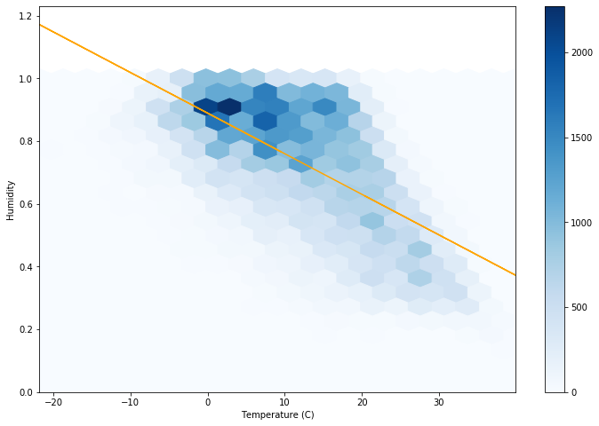

# ML-Toolkit
- Put a CSV in the "data" directory
- Select the number of your files specified when the user input is asked

It will display the heatmap like so :

You can easily pick up the variable that correlate and then plot the linear regression graph when asked for user input

